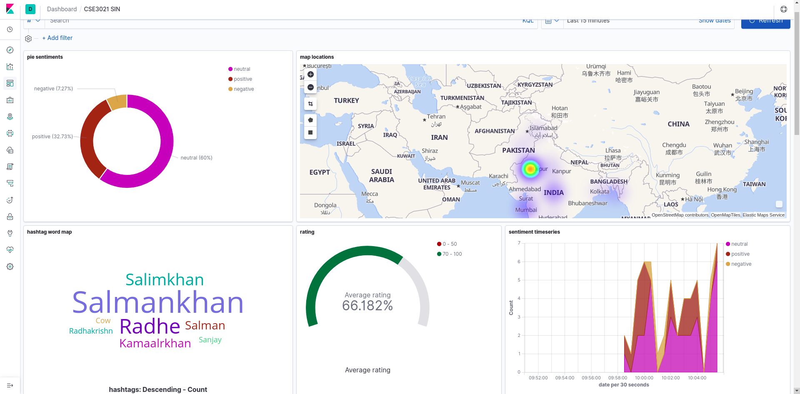
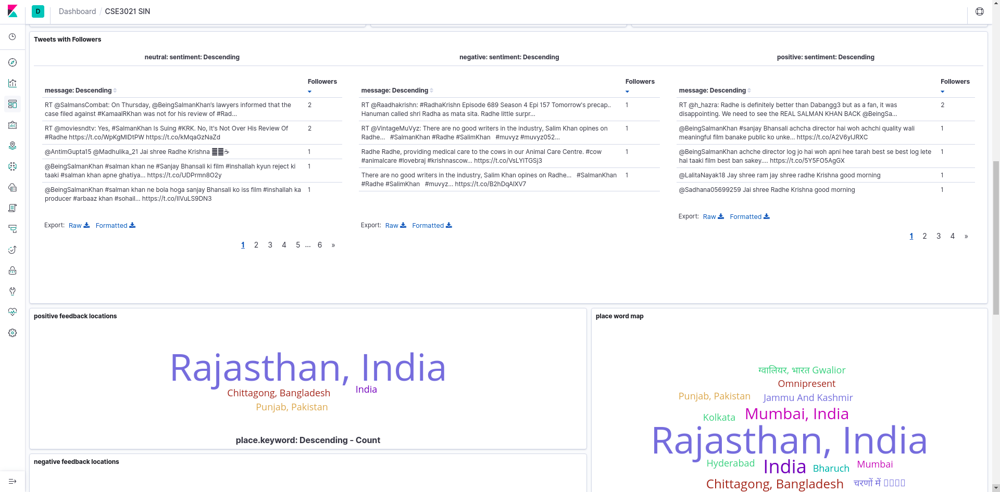
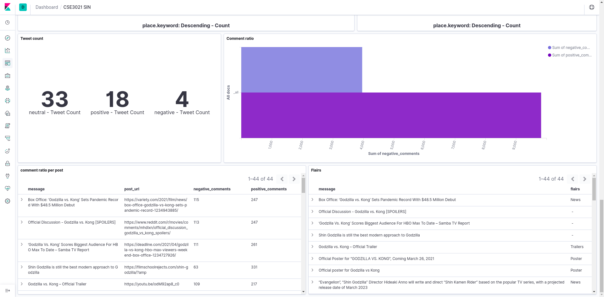

# CSE3021-SIN
Our platform used the data from **Twitter and Reddit API to stream and filters** extraneous anomalies, cleans the data, and then it runs sentimental analysis also while collecting important metadata and fields necessary for **geotagging.** It stores everything on elastic search instance for further processing in **Kibana Dashboard.**

The data is processed and displayed interactively using a bar graph, pie chart, heatmap, word map and dials, which makes visualising and viewing experience smoother.
The collected data is analyzed and categorized whether it is *positive, negative or neutral*. The hashtags used and most commonly occurring words are extracted and mapped to the word map. An extensive search can be made for reviews containing the words on the WordMap simply by clicking the word, and the changes are reflected in all the representations. The HashTags Keyword can represent the most commonly occurring hashtags or keywords in tweets/feedbacks for the Movies, this can be used to track social media engagement too.

## Run

### Running ELK 

```
docker-compose up
```
> Running on [localhost:5601](http://localhost:5601) and import [file](export.ndjson) to saved objects 

### Stream Data

create .env from [file](.env.example) and add keys

```
pip install -r requirements.txt

# reddit data
python Reddit.py

# twitter data
pyhton Twitter.py
```

## Screenshots

<p>
<br>
Pie Chart representing neutral, positive, and negative tweets. Heat Map showing areas where the movie audience count around the world. WordMap of hashtags on the left which can be clicked to filter results and Sentiment Count Graph and coresponding average ratings <br>
</p>

<p>
<br>
WordMaps of locations for good and poor reviews. Top tweets based on followers. Top performing Cities, Satisfaction Level, Twitter Sentiment Count<br>
<br>
</p>

<p>
<br>
Reddit posts and post flairs with the number of positive and negative comments, so the users get an idea of the overall comment thread. Total positive and negative comments of the posts and overall review along with the reddit url<br>
</p>
<h6>Built with <3 using Elasticsearch, Logstash, and Kibana.</h6>
